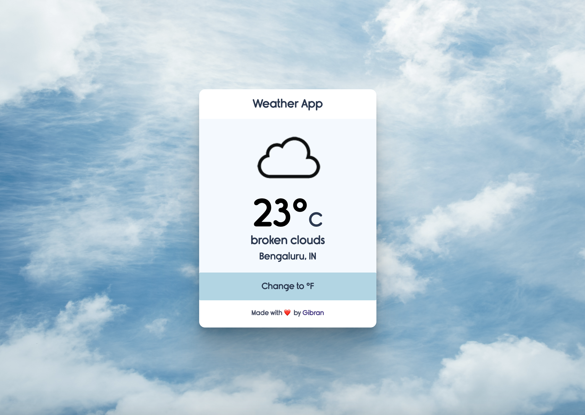

# ⛅️ Weather App

weather app using HTML, CSS, and JavaScript

# 🛠 built with
- HTML
- CSS
- Modern Javascript (ECMAScript2015+)
- Openweathermap API

### 🎨 Icons By 
> [manifestinteractive](https://github.com/manifestinteractive/weather-underground-icons)

### 🌐 Live Demo
https://syedgibran96.github.io/weatherapp/
